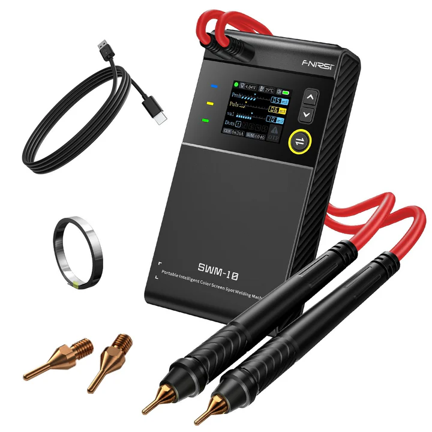

# Especificaciones
La máquina de soldadura por puntos portátil de mano SWM-10 es una herramienta de soldadura por puntos eficiente, conveniente y fácil de transportar.

## Característica:

    Máquina de soldadura por puntos con pantalla a color inteligente portátil
    Espesor de soldadura: 0,1-0,25 mm
    Carga/descarga: 5 V/2,1 A
    Soldador Mash + banco de energía móvil
    Corriente máxima de soldadura 1200A
    Anti-quemaduras inteligente
    Múltiples recordatorios de protección de seguridad
    Capacidad: 5000mAh
    Celdas de batería de grado A de alta calidad
    Materiales de soldadura: chapa de níquel, chapa de hierro, acero inoxidable.
    Bolígrafo especial para soldadura por puntos
    Descarga de corriente de 1200 A
    Engranaje: 4 engranajes de ajuste combinados

Presupuesto
Marca
FNIRSI
modelo
CANTIDAD-10
Capacidad
5000 mAh
Cargar
5 V/2,1 A
Descargar
5 V/2,1 A
Materiales de soldadura
Hoja de níquel, hoja de hierro, hoja de acero inoxidable, hoja de aluminio
Espesor de soldadura
0.1-0.25MM
Corriente de Soldadura Máxima
1200A
Engranaje
ajuste de engranaje de 4 combinaciones
Dimensión
155 mm x 82 mm x 28 mm

# Garantia

Uso del Entorno y Precauciones

El dispositivo debe almacenarse en una funda blanda, y el entorno de operación debe estar a una temperatura de -5~40℃, y la humedad relativa no debe exceder el 80%.

El dispositivo debe almacenarse en un lugar limpio y seco para evitar la humedad, el moho, la presión excesiva, daños mecánicos, la humedad y la luz solar directa.

Evite usarlo en la lluvia o en la niebla, evite dejarlo caer o golpearlo.

Cuando la pantalla del LCD no se enciende, indica que el voltaje es demasiado bajo y necesita ser cargada a tiempo.
Derechos de autor

Las especificaciones del producto están sujetas a cambios sin previo aviso, todos los derechos de interpretación final fueron reservados por FNIRSI Technology Co., Ltd. Todas las marcas registradas, imágenes de productos y parámetros técnicos son propiedad de FNIRSI Technology Co., Ltd. Todos los derechos reservados.
Garantía

Garantía de devolución y reembolso de 30 días (Consulte nuestra Política de Reembolso), garantía de 2 años (disponible solo para pedidos comprados directamente en fnirsi.com), soporte técnico de por vida por FNIRSI.
No dude en comunicarse con nosotros si tiene alguna inquietud:
Correo electrónico: service@fnirsi.com / info@fnirsi.com
Nos esforzamos por responderte dentro de 24 horas.

FNIRSI ha comenzado a investigar y desarrollar productos ópticos de calidad, incluyendo telémetros de golf, láseres, dispositivos de medición y binoculares desde 2016.
Enfocarse en el desarrollo, la investigación y la fabricación durante más de 8 años.
Estamos comprometidos a ofrecer productos de primera calidad y un servicio al cliente excepcional, esforzándonos por ser su asistente más confiable e inteligente
