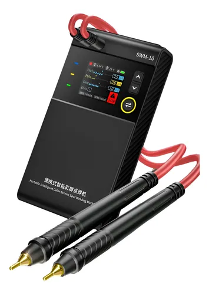

# SWM-10-Welding-Machine-calculos-y-uso
SWM-10 Welding Machine calculos y uso

## Parametros configurables

Principales

|Id|Nombre|Descripción|Min|Max|Por defecto|
|--|------|-----------|---|---|-----------|
|1|Voltaje|Voltaje bateria|3.7|4.2|4.2 VDC|
|2|Temperatura|Temperatura interna|||26 oC|
|3|Preheat|Precalentamiento|1 ms|10 ms|2 ms|
|4|Pulse|Pulso corriente|1 ms|30 ms|5 ms|
|5|Interval|Intervalos|1 ms|20 ms|5 ms|
|6|Dots|Puntos|1|5|1|

Internos

|Id|Nombre|Descripción|Min|Max|Por defecto|
|--|------|-----------|---|---|-----------|
|1|Welding delay|-|0|2.0 s|0.8 s|
|2|Interval between dots|Intervalos|0.8 s|1.2 s|0.5 s|
|3|Auto Off|Auto apagado|30 min|60 min|60 min|
|4|Screen|Brillo|0|100%|100%|
|5|Volume|Volumen|0|100%|100%|
|6|Languaje|Lenguaje|-|-|Chino|
|7|Screen Reverse|Orientacion del display|0|180 o|0 o|
|8|Overheating Warning|Advertencia de sobrecalentamiento|50 oC|75 oC|65 oC|
|9|Undervolt|Voltaje minimo|3.7 VDC|4.0 VDC|3.7 VDC|
|10|Protection short-circuit|Proteccion de corto circuito|on|off|on|
|11|Factory resetting|Reseteo de fabrica|-|-|-|